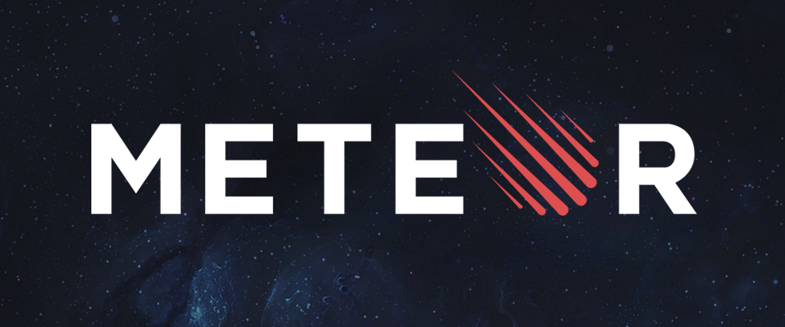

# Ressources en Programmation pour internet II - Meteor.js

Cet annuaire de ressources est destiné aux étudiant·e·s du cours [Programmation pour internet II - Meteor.js](https://applicationspub.unil.ch/interpub/noauth/php/Ud/ficheCours.php?v_enstyid=45169&v_langue=fr). Vous pouvez l'enrichir en envoyant un mail à [loic.cattani@unil.ch](mailto:loic.cattani@unil.ch?subject=Une%20nouvelle%20ressource%20en%20Meteor.js!) ou le partager avec [https://bit.ly/rmeteor22](https://bit.ly/rmeteor22).

Il s'agit d'un document vivant, il sera maintenu à jour et complété tout au long du cours

## Inscriptions

[Lien pour l'inscription au cours et à l'évaluation](https://www.unil.ch/lettres/fr/home/menuguid/etudiantes/enseignements-evaluations.html) (**Délai au 20 mars 2022**)

## Logiciels

- [VS Code](https://code.visualstudio.com/)
- [GitHub Desktop](https://desktop.github.com/)

### Terminal

- [PowerShell](https://docs.microsoft.com/en-us/powershell/scripting/install/installing-powershell-on-windows?view=powershell-7.2) (**essentiel** pour PC sous Windows)
- [iTerm](https://iterm2.com/) (facultatif pour macOS)

## Meteor

- [Meteor](https://www.meteor.com/)
- [Installer Meteor](https://www.meteor.com/developers/install)
- [Meteor Blaze Tutorial](https://blaze-tutorial.meteor.com/) (en)
- [Documentation Meteor](https://docs.meteor.com/#/full/)
- [Documentation Blaze](http://blazejs.org/guide/introduction.html)
- [Atmosphere](https://atmospherejs.com/) Bibliothèque de paquets Meteor
- [Code Style & ESLint](https://guide.meteor.com/code-style.html)

## Ressources UI/UX

- [Bootstrap 5](https://getbootstrap.com/)